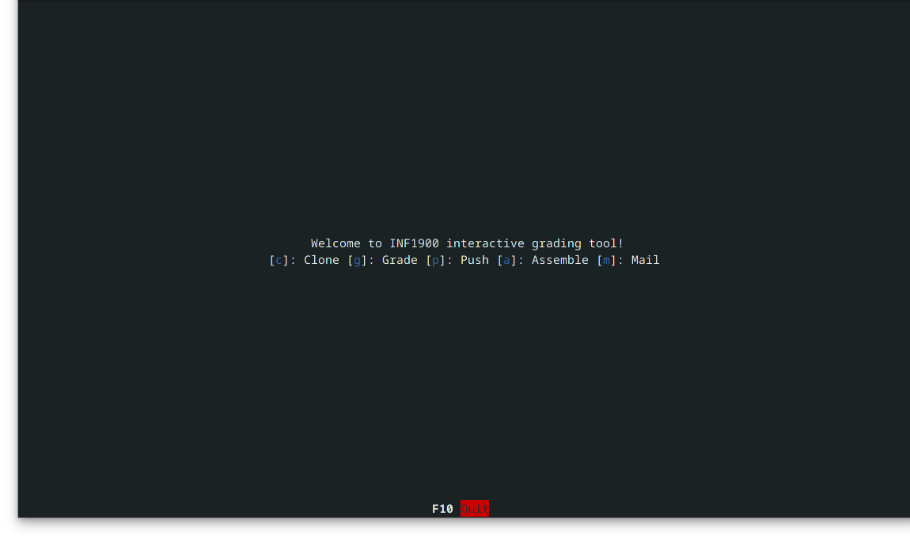
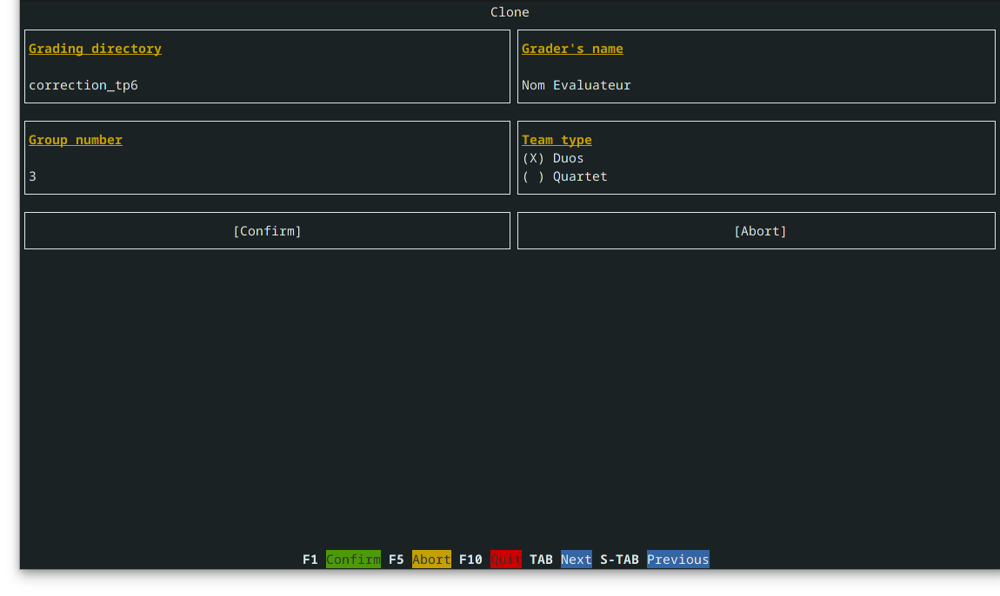
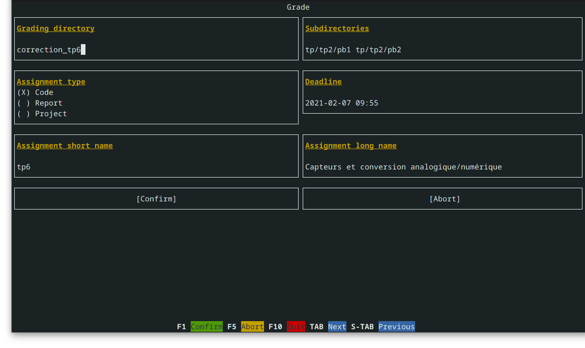
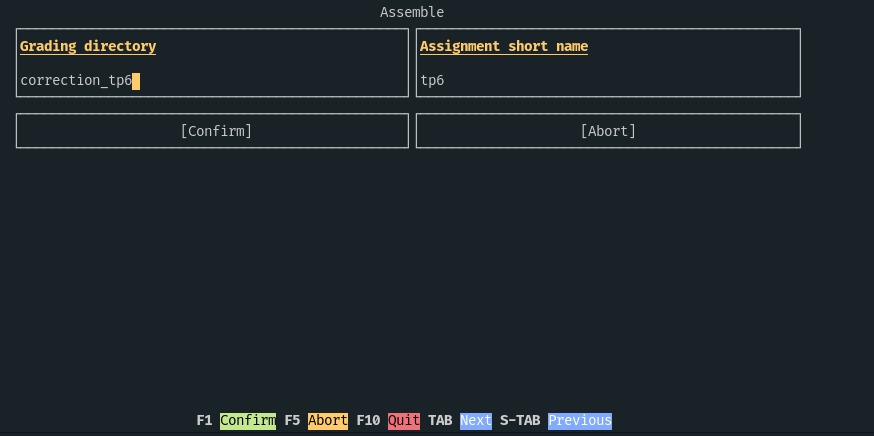
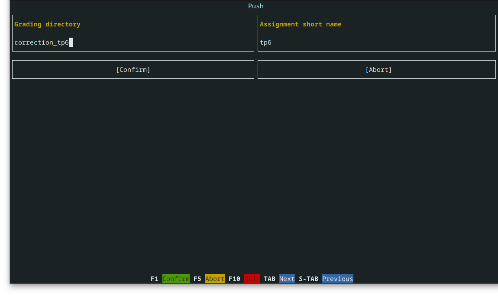
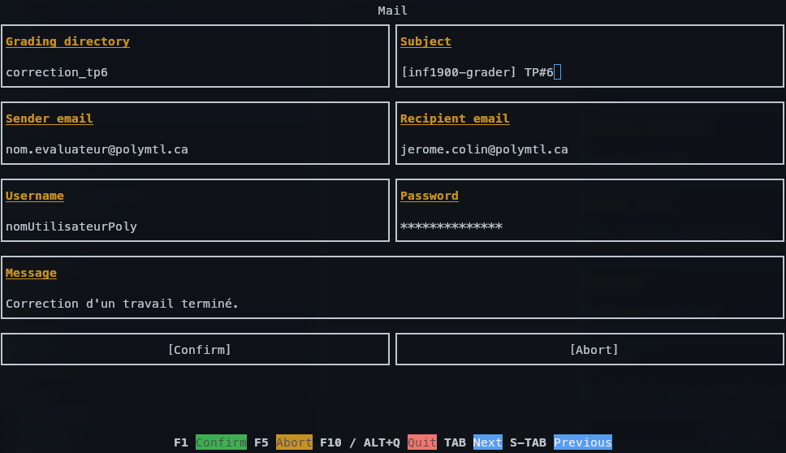

# Prérequis
- `$ git config --global credential.helper store`
- `$ git config --global user.name "Votre Nom"`
- `$ git config --global user.email prenom.nom@polymtl.ca`
- `$ pip3 install --user -r requirements.txt`
- [Outils AVR](http://www.groupes.polymtl.ca/inf1900/fichiers/)

> :warning: Notez que la commande `$ git config --global credential.helper store` sauvegarde vos informations (id et mdp) en texte dans le fichier `~/.git-credentials`. Vous pouvez supprimer le fichier à la fin de l'utilisation ou pour plus de sécurité, utiliser un keyring.

# Comment ça marche
- Lancez le script `./grader`.
- Suivez les étapes dans l'ordre dans lequel elles sont présentées.

> :information_source: Pour la première utilisation, après avoir fait la commande `$ git config --global credential.helper store`, clonez un répertoire d'étudiant manuellement, entrez vos informations et suprimez le par la suite, sinon vous ne réussirez pas à utiliser le `./grader`.

# Résumé des différentes étapes
1. [clone](#clone)
2. [grade](#grade)
3. [assemble](#assemble)
4. [push](#push)
5. [mail](#mail)

## clone
- `clone` récupérera les informations des élèves (nom, prénom, équipe,
  groupe) depuis le site du cours et clonera le repo de chaque équipe du groue spécifié par `Group number` dans le répertoire spécifié par `Grading directory`.
  

## grade
- `grade` vérifiera les fichiers inutiles, compilera le code des élèves et écrira un fichier de notes dans chaque repo. Il faut attribuer les notes manuellement, mais la majorité du travail répétitif est déjà automatisée. 
- `Grading directory` correspond au dossier de correction où les répertoires du groupe ont été clonés (voir section [clone](#clone)).
- `Subdirectories` sont la liste des dossiers où le code aurait dû être déposé pour la correction.
- `Assigment type` correspond au type de correction. `Code` pour la correction du code et `Report` pour la correction d'un rapport.
- `Deadline` correspond à la date de re mise de l'évaluation.
- `Assignment short name` correspond à tpx ou à projet et `Assignment long name` correspond à la description de l'évaluation.
  
  

## assemble
- `assemble` calcule le total des points pour chaque équipe et générera un fichier de notes `notes-inf1900-sectionXX-nom_travail.csv` à partir des notes entrées par le correcteur.
- `Grading directory` correspond au dossier de correction où les répertoires du groupe ont été clonés (voir section [clone](#clone)).
- `Assignment short name` correspond à `tpx` ou à `projet` (voir section [grade](#grade)).
  
  
  
## push
- `push` pushera un commit sur le master de chaque repo des équipes de la section à corriger.
- `Grading directory` correspond au dossier de correction où les répertoires du groupe ont été clonés (voir section [clone](#clone)).
- `Assignment short name` correspond à `tpx` ou à `projet` (voir section [grade](#grade)).
  
  

## mail
- `mail` enverra un email à Jérôme et joindra le fichier de notes `csv` (voir section [assemble](#assemble)).
- `Sender email` est votre adresse email.
- `Recipient email` est le responsable du cours.
- `Grading directory` correspond au dossier de correction où les répertoires du groupe ont été clonés (voir section [clone](#clone)).
- `Subject` le sujet du email.
- `Message` correspond au message du email.

  

# Ce qui manque
- Intégration à `clang-format` et `clang-tidy`.
- Simuler les programmes des étudiants à l'aide de `simavr`.
